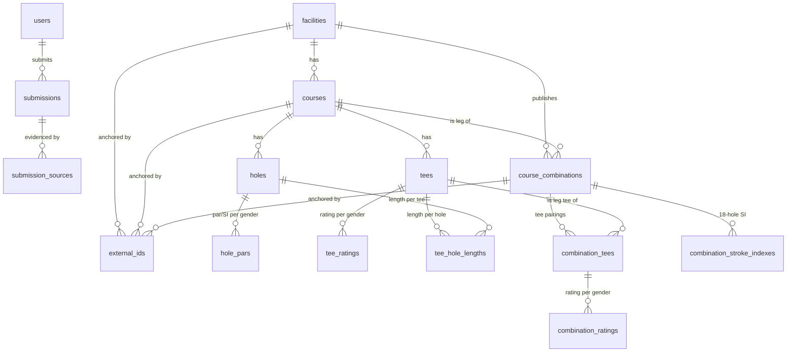

# OpenTee Schema Design

This document explains the v1 database schema (`db/schema.sql`): what it must represent,
why the initial AI-drafted proposal was restructured, and the reasoning behind each design
decision. Read this before proposing schema changes.

## Goals

OpenTee is an open, community-contributed database of golf course scorecard data,
**as published by courses** — scorecards, rating stickers, and course websites. The
product goals, in priority order:

1. **Faithful archive.** Store what the course publishes, verbatim: yardages *or meters*,
   per-gender par and stroke-index rows, ratings when they exist (and their absence when
   they don't), hole names, tee order and colors, 27-hole pairings, nines played twice.
2. **Community submission with moderation.** Users submit whole scorecards with evidence;
   moderators approve; every approved fact is attributable and revertible.
3. **Fast, simple reads.** Viewing yardages and printing custom scorecards is the whole
   point; the common queries must be straightforward and index-supported.

## The starting proposal and why it was restructured

The project began from an AI-drafted five-table schema
(`facilities → courses → tee_boxes → holes → hole_tee_data`). Its instincts were right —
facility/course separation, per-tee hole data, recognizing that par and handicap vary
beyond the hole itself — and that skeleton survives in v1. A five-lens review
(golf-domain accuracy, PostgreSQL practice, community-platform needs, the scorecard/print
use case, and stress tests against real course shapes) converged on a consistent set of
defects:

1. **Gender was baked into the physical tee.** `tee_boxes` carried a `gender` column, so
   a White tee rated for men *and* women became two rows — and every hole yardage had to
   be entered twice, with nothing keeping the copies in sync. In reality a tee is one
   physical object with one set of lengths; under the World Handicap System it receives
   *ratings* per gender (0, 1, or 2 of them).
2. **Ratings were mandatory.** `course_rating`/`slope_rating` were `NOT NULL`, making
   unrated courses — par-3 courses, executive courses, many municipal nine-holers, newly
   built tees — unstorable without fabricating numbers.
3. **Par and stroke index were at the wrong grain.** Real cards print one men's and one
   ladies' par/handicap row shared across all tees (St Andrews Old is par 72 for men,
   76 for women). Keying them per tee-per-gender stored each value up to ten times and
   let copies contradict each other.
4. **No unit of measure.** Most of the golfing world outside North America and the
   UK/Ireland publishes **meters**; an implicit-yards `yardage` column silently corrupts
   those cards, unrecoverably.
5. **Cross-course corruption was representable.** The bridge table's two independent FKs
   allowed a tee from course A to be paired with a hole from course B — printing a mixed
   scorecard with no error anywhere.
6. **27-hole facilities and nines-played-twice had no representation** without entering
   shared holes two or three times (see below).
7. **The community layer didn't exist.** No users, no moderation states, no sources, no
   history — "users can submit" was unimplemented.
8. Plus mechanical gaps: nullable FKs everywhere, zero CHECK constraints, free-text
   gender, blanket `ON DELETE CASCADE` at the top of the hierarchy, `SERIAL`/`VARCHAR(n)`
   idioms, no `updated_at`, no FK indexes, no dedupe/merge story.

## Entity model



(Simplified: `submissions` also carries nullable references to the facility, course, or
combination it targets, and `facilities.merged_into_id` is a self-reference used by
merge tombstones.)

### The physical/rating split (tees vs. tee_ratings)

A **tee** is the physical set of markers: name, color, unit, display order. Its hole
lengths (`tee_hole_lengths`) are stored **exactly once** — lengths are a physical fact
that does not vary by gender. A **tee_rating** is a WHS rating issued for that tee for
one gender: rating, slope, bogey rating, front/back-nine splits, effective date.

- Dual-rated tee → one `tees` row, two `tee_ratings` rows.
- Men-only back tee → one rating row.
- Unrated par-3 course → zero rating rows. *Absence of a rating is absence of a row*,
  never a fake value.

### Par and stroke index (hole_pars)

Keyed `(course, hole, gender)` with `gender ∈ {men, women, unisex}` — matching the
printed card, where one men's and one ladies' row apply across all tees. `unisex` is for
cards that publish a single undifferentiated par/handicap row (common on nine-holers and
short courses); a course should use *either* gendered rows *or* unisex rows, which the
submission layer enforces (DDL can't see across rows cheaply).

Decisions folded in here:

- **Stroke index is nullable** — many par-3/executive cards omit it.
- **Stroke-index uniqueness within a card is deliberately not a hard constraint.** Some
  published cards genuinely violate the 1–18 permutation; we archive "as published" and
  flag duplicates for reviewer attention in the submission flow instead.
- **Par range is 3–7** — par-6 holes exist (e.g. the 673-yard Lake Chabot #18) and a
  handful of international par-7s.
- The column is named `stroke_index`, not "handicap index" — a Handicap Index is a
  *player's* number under WHS; the misnomer in the original draft would have confused
  every contributor.
- **Known simplification:** the rare course that publishes *different pars for different
  tees within the same gender* is not representable in v1. If it proves needed, the
  planned extension is a sparse per-tee override table, not a change of the base grain.

### Units (tees.unit)

Every tee declares `yards` or `meters`, and lengths are stored **verbatim as published**
— never converted on write. Conversion happens at display time, labeled as converted.
Unit lives on the tee (not the course) because it is the natural grain for the lengths
that hang off it, and dual-unit cards can then be represented as needed.

### Courses, nines, and combinations

A **course** is one named loop of physically distinct holes:

- A standard course: `hole_count = 18`.
- Each nine at a 27-hole club: its own course with `hole_count = 9`.
- Odd layouts (12-hole courses, 13-hole short courses) are just courses with that
  `hole_count`.

A **course_combination** is a *published playing configuration* built from two course
legs, with `first_course_id = second_course_id` explicitly legal:

- Trillium-style 27-hole club → three combinations (North/South, South/West, North/West),
  each with its own `combination_tees` (which physical tee is played on each leg — e.g.
  North's Blue + South's Blue) and `combination_ratings` per gender. A combination tee
  carries the card's `unit`, and both leg FKs include it — pairing a yards tee with a
  meters tee is unrepresentable, so the combined total always has an unambiguous unit.
- A nine-hole course played twice → one combination with both legs pointing at the same
  course, and the classic "White out, Yellow in" card expressed as a tee pairing.
- `combination_stroke_indexes` holds the 18-hole SI allocation printed on the combined
  card (positions 1–18), which is genuinely different data from each nine's own 1–9 card:
  the same physical hole can be SI 5 on the way out and SI 6 coming in.

Hole data is **never duplicated** into a combination: positions map through the legs
(`position ≤ first.hole_count` → first course, else second course at
`position − first.hole_count`), so correcting a hole on the North nine automatically
corrects every card that includes North. Par always comes from the underlying course's
`hole_pars`.

Two alternatives were considered and rejected:

- *Every 18-combo as its own course* (how some commercial databases model it): triple
  data entry, guaranteed drift between copies — the exact failure mode a community
  database must avoid.
- *Nine as the universal structural unit* (every 18-hole course = two nines + a
  configuration): handles the same cases but taxes the overwhelmingly common case —
  a plain 18-hole course — with structural indirection, and still breaks for 12/13-hole
  layouts. The overlay model keeps simple things simple and hard things possible.

**Known simplification:** composite courses that cherry-pick holes across loops (the
Royal Melbourne Composite pattern) don't fit a two-leg combination; they can be entered
as standalone courses, accepting duplication for that rare case.

### Combination tees within one course ("Blue/White")

Distinct from course combinations: many courses publish a *combo tee* that alternates
two existing tees hole by hole. These are physical rows in `tees`
(`is_combination = true`), and each of their `tee_hole_lengths` rows records
`source_tee_id` — which parent tee that hole plays from — so views can flag drift when a
parent tee is corrected but the combo copy is not. They print through exactly the same
queries as any other tee.

### Corruption-proof composition (composite FKs)

Postgres composite foreign keys make cross-entity corruption *unrepresentable*:

- `tee_hole_lengths (tee_id, course_id) → tees (id, course_id)` and
  `(course_id, hole_number) → holes` — a tee can only ever join holes of its own course.
- `course_combinations (first_course_id, facility_id) → courses (id, facility_id)` —
  legs must belong to the combination's facility.
- `combination_tees (first_tee_id, first_course_id) → tees (id, course_id)` — each leg's
  tee must belong to that leg's course.

`holes` uses its natural key `(course_id, hole_number)` directly: hole number is
immutable identity, the surrogate id was a contentless join hop, and the natural key is
what makes the composite FKs cheap. The table earns its existence by carrying per-hole
facts that vary by neither tee nor gender — starting with hole names (`"Burn"`, `"Road"`,
`"Tea Olive"`), later green coordinates, photos, notes.

### The community layer (users, submissions, submission_sources)

Canonical tables only ever contain **approved** data. The write path is an atomic
envelope:

1. A user submits a whole facility record or whole course scorecard as a JSONB `payload`
   (application-versioned; include a `schema_version` key), with at least one
   `submission_source` — scorecard photo, rating-sticker photo, website URL — carrying
   the `effective_date` printed on the artifact (rating stickers are dated; ratings
   expire).
2. A moderator approves; one transaction applies the payload to the canonical tables and
   stamps `reviewed_by`/`reviewed_at` (CHECK-enforced for approved/rejected rows).
   New-entity submissions get their `facility_id`/`course_id` backfilled by the approval
   transaction — that backfill is the approval writer's contract (a CHECK ties the
   target columns to `kind`, but DDL cannot require a target on approval without
   forbidding legitimate new-entity payloads).
3. History = the chain of approved submissions per entity. Revert = re-apply an earlier
   approved payload. Attribution ("who added this course?") = query its submissions.

This gives moderation, provenance, history, and revert with **two tables**, and scales
per-scorecard rather than per-cell. Deliberately deferred until the data demands them:
field-level diffs, temporal/system-versioned tables, reputation scoring, verification
counts ("confirmed by N users"), OCR ingestion.

### Identity, dedupe, and lifecycle

- **Slugs** on facilities (`/sandpiper-dunes-golf-resort`) and courses/combinations
  (unique per facility) give stable, human URLs.
- **Duplicates are tombstoned, not deleted:** `facilities.merged_into_id` + status
  `duplicate` turns the loser of a merge into a redirect; a CHECK ties the two together.
  Old bookmarks keep resolving. The merge itself is one transaction:
  `SET CONSTRAINTS fk_combinations_first_course, fk_combinations_second_course DEFERRED`
  (the two combination-leg FKs are declared `DEFERRABLE` for exactly this), repoint
  `courses`, `course_combinations`, `external_ids`, and `submissions` to the survivor,
  re-slug any children whose slugs collide, then tombstone the loser. The recipe is
  exercised in `db/tests/constraint_tests.sql` against a combination-owning facility.
- **`external_ids`** anchors facilities, courses, and combinations to other systems
  (`usga_crdb`, `ghin`, `osm`, `golf_australia`, …) with `UNIQUE (namespace,
  external_id)` — the primary machine signal for duplicate detection. Combinations are
  anchorable because official rating databases publish each 18-hole pairing as its own
  rated entity.
- **`pg_trgm` GIN index** on facility names powers "did you mean…" during submission.
  There is deliberately no hard UNIQUE on facility names: legitimately identical names
  exist in different cities.
- **Deletion is defensive:** `facilities → courses` is `ON DELETE RESTRICT`, and any
  facility, course, or combination that has ever been targeted by a submission is
  RESTRICT-protected too — the approved-submission history chain can never be silently
  severed by a single `DELETE` (deliberate teardown must remove the submissions
  explicitly first; entities that entered outside the submission flow, such as bulk
  imports, gain this protection only once a submission references them). Cascade exists
  only where a child is meaningless without its parent (course → holes/tees,
  tee → ratings/lengths); the combo-tee provenance FK (`source_tee_id`) is *deferred*
  rather than RESTRICT so course deletion cascades independently of internal FK-trigger
  ordering, while a bare delete of a parent tee is still rejected at commit. Real-world
  "deletion" (course closed) is a `status` flip. Deleting a user is RESTRICTed —
  contributors with history are deactivated, preserving attribution.

### Data-quality rails

Named CHECK constraints are the first line of moderation (violations surface as
actionable names in the submission UI): slope 55–155 (its defined domain), course rating
15–90 (covers 9-hole ratings), par 3–7, stroke index 1–18, lengths 20–1500, hex color
shapes, lowercase-canonical `gender` values, ISO-3166 alpha-2 `country`, slug shape,
email shape, one-evidence-minimum on sources, review-fields-on-approval. Bounds are
sanity rails for community input, not exact domain law — they reject the garbage that
free-text columns would print as truth.

Two rules are deliberately **soft** (application-layer, not DDL): hole_number ≤
hole_count consistency, and gendered-vs-unisex par-row exclusivity. Both need cross-row
visibility that DDL handles poorly, and both are enforced naturally by the
submission-approval writer.

### Published vs. computed totals

Cards print OUT/IN/TOTAL — and occasionally misprint them. Policy: totals are **derived**
(`v_tee_summaries` computes them from per-hole lengths), while
`tees.published_total_length` optionally archives the verbatim printed figure. When the
two disagree on a complete tee, `has_total_discrepancy` flags it: the mismatch is either
a transcription error or a genuine misprint on the card, and both are worth a reviewer's
attention. The seed data plants one such misprint (Red tees at the fictional Sandpiper
Dunes) as a living example. `v_tee_summaries.is_complete` gates rendering of partially
entered tees using an exact-set test (exactly holes 1…hole_count — a stray out-of-range
hole row surfaces as *incomplete* rather than faking a full card).
`v_combination_tee_summaries` applies the same policy to combination cards: per-leg
OUT/IN, combined totals, completeness of both legs, and misprint detection against the
combined card's published total.

### PostgreSQL conventions

`uuid PRIMARY KEY DEFAULT gen_random_uuid()` surrogate keys on every table that has
one — globally unique identifiers mean records are non-enumerable, safe to mint
client-side, and immune to the sequence-desync and id-collision problems that plague
imports, merges, and any future federation between OpenTee instances (the trade-off —
16 bytes vs 8 and random-v4 index locality — is acceptable at this scale; if write
volume ever makes it matter, switch the default to a time-ordered UUIDv7, which
PostgreSQL 18 provides natively and applications can generate today); `text` with
length CHECKs instead of `varchar(n)`; `timestamptz` `created_at`/`updated_at` with one
shared trigger on every table except the two append-only ones (`external_ids` and
`submission_sources` carry `created_at` only); every FK column indexed unless it
already leads another index; `DEFERRABLE INITIALLY DEFERRED` uniqueness on display
order so reorders swap in one transaction; all CHECK, UNIQUE, and composite PK/FK
constraints explicitly named (single-column FKs and surrogate-key PKs keep Postgres's
descriptive auto-names like `courses_facility_id_fkey`).

## Explicitly deferred (with the extension path)

| Deferred | Why | Path when needed |
| --- | --- | --- |
| Per-tee par overrides | Rare; base grain is per gender | Sparse override table keyed (tee, hole, gender) |
| `rating_system` discriminator (pre-2020 CONGU SSS etc.) | GB&I moved to WHS in 2020; current cards publish Rating/Slope | Nullable text column on the rating tables |
| Verification counts / reputation | Envelope model captures evidence already | `verifications(submission_id, user_id)` |
| Field-level history / temporal tables | Approved-payload chain covers revert | Layer on `submissions` |
| PostGIS | Plain lat/lng columns suffice for browse/dedupe | Swap columns for `geography(Point)` |
| Hole geodata (green lat/lng), photos | Not scorecard data | New columns/tables on `holes` |
| Course-level merge tombstones | Facility-level covers the observed dupe pattern | Mirror `merged_into_id` on courses |

## Example queries

Fetch a printable card for one course, chosen tees side by side (the app pivots rows to
columns):

```sql
SELECT hole_number, hole_name, tee_name, length,
       par_men, stroke_index_men, par_women, stroke_index_women,
       par_unisex, stroke_index_unisex
FROM v_scorecards
WHERE course_slug = 'dunes'
  AND facility_id = (SELECT id FROM facilities WHERE slug = 'sandpiper-dunes-golf-resort')
  -- custom card: any subset of tees, selected by stable uuid (seed ids shown)
  AND tee_id IN ('00000000-0000-4000-8000-000400000002',   -- Blue
                 '00000000-0000-4000-8000-000400000003',   -- White
                 '00000000-0000-4000-8000-000400000005')   -- Red
ORDER BY hole_number, display_order;
```

OUT/IN/TOTAL, completeness, and misprint detection:

```sql
SELECT tee_name, out_length, in_length, computed_total_length,
       published_total_length, has_total_discrepancy, is_complete
FROM v_tee_summaries
WHERE course_id = '00000000-0000-4000-8000-000300000001'   -- Dunes (seed id)
ORDER BY display_order;
```

An 18-hole card for a combination (two nines, or one nine twice) — positions map through
the legs, so no hole is stored twice:

```sql
WITH positions AS (
    SELECT cc.id AS combination_id, gs.position,
           CASE WHEN gs.position <= c1.hole_count THEN cc.first_course_id
                ELSE cc.second_course_id END AS course_id,
           CASE WHEN gs.position <= c1.hole_count THEN gs.position
                ELSE gs.position - c1.hole_count END AS hole_number,
           gs.position <= c1.hole_count AS is_first_leg
    FROM course_combinations cc
    JOIN courses c1 ON c1.id = cc.first_course_id
    JOIN courses c2 ON c2.id = cc.second_course_id
    CROSS JOIN LATERAL generate_series(1, c1.hole_count + c2.hole_count) gs(position)
    WHERE cc.slug = 'north-south'
      AND cc.facility_id = (SELECT id FROM facilities WHERE slug = 'trillium-creek-country-club')
)
SELECT p.position, c.name AS nine, p.hole_number, ct.name AS tee, thl.length,
       hp.par, csi.stroke_index AS card_stroke_index
FROM positions p
JOIN courses c ON c.id = p.course_id
JOIN combination_tees ct ON ct.combination_id = p.combination_id AND ct.name = 'Blue'
JOIN tee_hole_lengths thl
     ON thl.tee_id = CASE WHEN p.is_first_leg THEN ct.first_tee_id ELSE ct.second_tee_id END
    AND thl.hole_number = p.hole_number
LEFT JOIN hole_pars hp
     ON hp.course_id = p.course_id AND hp.hole_number = p.hole_number
    AND hp.gender IN ('men', 'unisex')
LEFT JOIN combination_stroke_indexes csi
     ON csi.combination_id = p.combination_id AND csi.position = p.position
    AND csi.gender IN ('men', 'unisex')
ORDER BY p.position;
```

Fuzzy facility search for submission-time dedupe:

```sql
SELECT slug, name, city, state_province, similarity(name, 'sandpiper dunes gc') AS score
FROM facilities
WHERE name % 'sandpiper dunes gc' AND status = 'active'
ORDER BY score DESC
LIMIT 5;
```

## Running it

```bash
createdb opentee_dev
psql -v ON_ERROR_STOP=1 -d opentee_dev -f db/schema.sql
psql -v ON_ERROR_STOP=1 -d opentee_dev -f db/seed/example_seed.sql   # optional demo data
psql -v ON_ERROR_STOP=1 -d opentee_dev -f db/tests/constraint_tests.sql
```

The seed data is entirely fictional but structurally realistic, and exercises every
feature above. Its cross-referenced rows use fixed, readable UUIDs in the pattern
`00000000-0000-4000-8000-TTTTNNNNNNNN` (TTTT tags the entity type — 0001 users, 0002
facilities, 0003 courses, 0004 tees, 0005 combinations, 0006 combination tees, 0007
submissions — and N is a sequence number); real application inserts should omit ids
and take the `gen_random_uuid()` default. Feature coverage: dual-gender ratings over single length sets, a men-only rated tee, an
unrated par-3 nine, a metric course, unisex par rows, a within-course combo tee, a
27-hole club's three pairings, a nine played twice with different tees per loop, the
submission/evidence trail, and one planted misprint. The test suite runs in a
transaction and rolls back — it never mutates the database it runs against.

`db/schema.sql` is the canonical v1 definition. Once an application stack is chosen,
adopt a migration tool (sqitch, dbmate, Flyway, or the ORM's migrator) and treat this
file as migration 0001.
